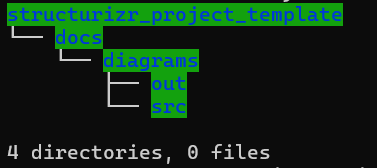

# Opinionated Structurizr Project Layout and Workspace Template

This open source project aims to promote adoption of the [C4 model](https://c4model.com/)&copy; and the [Structurizr&copy; DSL and Tool](https://structurizr.com/) created by the software architect [Simon Brown](https://simonbrown.je/) through an easy to use and integrate **opinionated** implementation example of a Structurizr Project Layout and Workspace Template to quickly bootstrap a software architecture diagrams for a project based on the C4 model and Structurizr "Diagram as Code" (DaC) approach.

## Structurizr Project Layout and Workspace Template

There are two options available:
- Structurizr layout only
- PlantUML + Structurizr layout

### Structurizr Layout Only

#### The layout without documentation


````sh
structurizr_project_template
├── constants.dsl
├── model.dsl
├── roles.dsl
├── styles
│   └── styles.dsl
├── themes
│   └── theme.json
├── views.dsl
└── workspace.dsl
````

#### The layout with documentation


````sh
structurizr_project_template
├── adrs
│   └── architecture-decision-record-0001.md
├── constants.dsl
├── docs
│   ├── context.md
│   ├── functional-overview.md
│   ├── images
│   └── quality-attributes.md
├── model.dsl
├── roles.dsl
├── styles
│   └── styles.dsl
├── themes
│   └── theme.json
├── views.dsl
└── workspace.dsl
````

### PlantUML + Structurizr Layout

#### The PlantUML Project Layout Only



````sh
structurizr_project_template
└── docs
    └── diagrams
        ├── out
        └── src
````

#### The PlantUML Project Layout with Structurizr Workspace Template


````sh
structurizr_project_template/
└── docs
    └── diagrams
        ├── out
        └── src
            ├── adrs
            │   └── architecture-decision-record-0001.md
            ├── constants.dsl
            ├── docs
            │   ├── context.md
            │   ├── functional-overview.md
            │   ├── images
            │   └── quality-attributes.md
            ├── model.dsl
            ├── roles.dsl
            ├── styles
            │   └── styles.dsl
            ├── themes
            │   └── theme.json
            ├── views.dsl
            └── workspace.dsl
````


## Structurizr project layout and workspace template Generator

The bash script `structurizr-project-template.sh` is a Structurizr project layout and workspace template Generator. It generates folder structure with empty files (placeholders).

````sh
$ ./structurizr-project-template.sh --help

Usage: ./structurizr-project-template.sh [OPTION]
Options:
  -p, --plantuml   Create PlantUML project layout
  -w, --workspace  Create Structurizr workspace template
  -d, --doc        Generate Structurizr project documentation template
  -c, --clean      Clean (delete) project directory
  -h, --help       Display this help message

By default, without any option provided, the script creates both the PlantUML project layout and Structurizr workspace and documentation template.

````

## Known Bugs and TODO

- TODO: The Generator: generate files with a sample content.

## Support

The source code of the project is provided on "as is" terms with no warranty (see license for more information). Do not file Github issues with generic support requests.


## License

This project is released under the terms of the GNU Lesser General Public License (LGPL). See LICENSE file for details.
